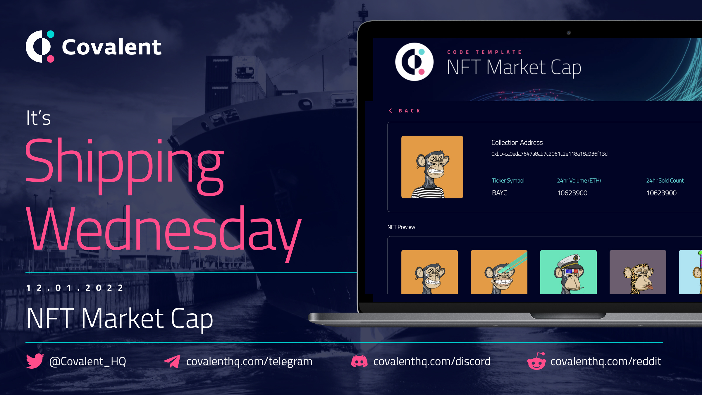

# NFT Market Cap Demo App
Just press `Run` to see this demo app in action with the following features:

* A global summary table of NFT collections per selected blockchain, sorted by market cap
* Ability to select a row in the global summary table to get a collection detail view and a preview of the first 5 NFTs in the collection 
* Ability to select one of the NFTs and see its metadata


## Fork
Feel free to fork this repl and use as you like. In order to run the demo app, you will need to:

1. Obtain your own Covalent API key [here](https://www.covalenthq.com/platform)

2. In the sidebar, the icon with a padlock will take you to a pane where you can set environment variables. Create an environment variable **key** called: `REACT_APP_COVALENT_API` and set the value to be your Covalent API key from step 1. 

## Purpose
The market cap of any crypto asset is an important metric for knowing how well that asset is performing. For getting the NFT market cap, there are various tools like CoinMarketCap or CoinGecko but none of them provides an endpoint for it.

The NFTMarketCap endpoints aim to fill that exact gap in the market by adding brand new series of NFT endpoints to the [Class A family](https://www.covalenthq.com/docs/api).

## API Endpoints
The two Covalent API endpoints used in this demo app include:

1. Global view of Market Cap per blockchain:
```
/{chain_id}/nft_market_cap
```

This endpoint provides a global view of multiple NFT collections from various marketplaces (from multiple chains) in a table that ranks them on their market cap.

The response object looks similar to the following:
```
{
  "data": {
    "updated_at": "2021-12-19T01:19:05Z",
    "items": [
      {
        "chain_id": 1,
        "collection_name": "Art Blocks",
        "collection_address": "0xa7d8d9ef8d8ce8992df33d8b8cf4aebabd5bd270",
        "volume_eth_24h": "200068300000000000000",
        "volume_quote_24h": 798097.3,
        "avg_volume_eth_24h": "1064193085106380000",
        "avg_volume_quote_24h": 4245.198,
        "contract_deployment_at": null,
        "market_cap_eth": "207008137260122000000000",
        "market_cap_quote": 825781180,
        "transaction_count_alltime": 121941,
        "unique_wallet_purchase_count_alltime": 22858,
        "unique_token_ids_sold_count_alltime": 65862,
        "max_price_eth": "2100000000000000000000",
        "max_price_quote": 8377161.0,
        "floor_price_eth": "955014280778427000",
        "floor_price_quote": 3809.6707,
        "eth_quote_rate": 3989.1243,
        "quote_currency": "USD",
        "opening_date": "2021-12-18"
      },
```

2. Detail view of a specific collection:
```
/{chain_id}/nft_market_cap/{collection}
```
This endpoint allows one to drill down into the details of a collection and the response boject looks similar to the following:
```
{
  "data": {
    "updated_at": "2021-12-19T05:25:26.926980Z",
    "items": [
      {
        "chain_id": 1,
        "collection_name": "MyCryptoHeroes:Land",
        "collection_address": "0x617913dd43dbdf4236b85ec7bdf9adfd7e35b340",
        "collection_ticker_symbol": "MCHL",
        "volume_eth_24h": "0",
        "volume_quote_24h": 0.0,
        "average_volume_eth_24h": "0",
        "average_volume_quote_24h": 0.0,
        "eth_quote_rate": 3905.4487,
        "opening_date": "2020-09-29",
        "volume_eth_day": "500000000000000000",
        "volume_quote_day": 176.95366,
        "average_volume_eth_day": "500000000000000000",
        "average_volume_quote_day": 176.95366,
        "unique_token_ids_sold_count_day": 1,
        "eth_quote_rate_day": 353.90732,
        "quote_currency": "USD"
      },
```
Data for the detail view is at a day granularity. 

## Feedback and Support

If you have any questions, comments and feedback regarding this demo app, please message us in our Discord: https://covalenthq.com/discord
